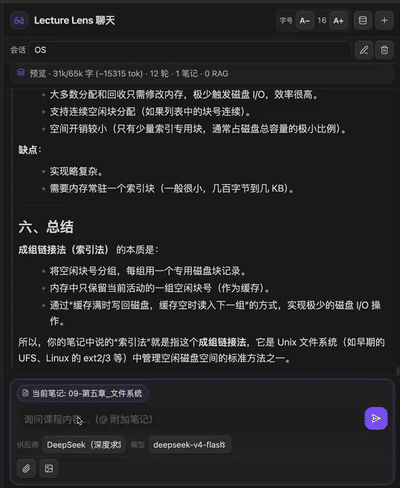
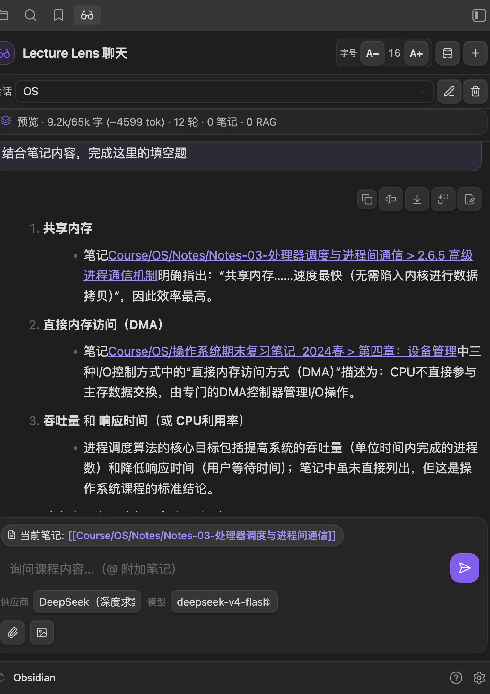
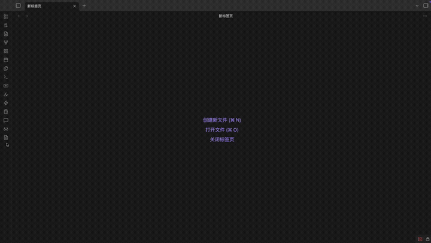

# Lecture Lens

[](https://github.com/Yima-Gu/obsidian-lecture-lens/releases/latest)
[](LICENSE)
[](https://obsidian.md/plugins?id=lecture-lens)

> **Turn lecture PDFs, slides, and screenshots into structured Obsidian notes — with AI chat, course RAG, and source citations.**
>
> **把课件 PDF、幻灯片截图变成 Obsidian 结构化笔记 — 附带 AI 聊天、课程 RAG 检索与来源引用。**

**Search keywords / 搜索关键词:** `PDF to Markdown` · `lecture notes` · `course assistant` · `AI chat` · `RAG` · `OCR` · `DeepSeek` · `Kimi` · `课件` · `PDF转笔记` · `大模型` · `课程助手` · `复习` · `识图`

[English](#english) · [中文](#中文) · [Changelog](./CHANGELOG.md) · [Community plugin page](https://obsidian.md/plugins?id=lecture-lens)

---

## What is Lecture Lens? / 这是什么？

|             |                                                                                                                                                                                                                                                                                                                                                             |
| ----------- | ----------------------------------------------------------------------------------------------------------------------------------------------------------------------------------------------------------------------------------------------------------------------------------------------------------------------------------------------------------- |
| **English** | **Lecture Lens** is an Obsidian plugin for **students and self-learners**. It uses LLMs (DeepSeek, Kimi, OpenAI, Gemini, etc.) to **convert lecture PDFs to Markdown**, **OCR slides and whiteboard photos**, and **answer questions** in a chat sidebar — with optional **local RAG** over your course folder and **clickable `[[wiki link]]` citations**. |
| **中文**    | **Lecture Lens** 是面向**学生与自学者**的 Obsidian 插件。接入大模型（DeepSeek、Kimi、OpenAI、Gemini 等），可 **PDF 课件转 Markdown 笔记**、**识图/OCR 幻灯片与白板**、在侧边栏 **AI 聊天答疑**，并可选对课程文件夹做 **本地 RAG 检索**，回答中带可点击的 **`[[双链引用]]`**。                                                                               |

**Typical workflows / 典型场景**

- 📄 **PDF lecture → notes** — batch-convert course PDFs into structured Markdown with formulas and headings  
  **PDF 课件 → 笔记** — 批量将 PDF 转为含公式、标题的结构化 Markdown
- 🖼️ **Screenshot → notes** — paste or attach slides; AI extracts text, LaTeX, and diagrams  
  **截图 → 笔记** — 粘贴或上传幻灯片，AI 提取文字、公式与图表
- 💬 **Course Q&A** — chat with `@` attached vault notes; streaming Markdown + math rendering  
  **课程问答** — `@` 附加库内笔记后提问，流式 Markdown / 公式渲染
- 🔍 **RAG over your vault** — index a course folder; retrieve relevant chunks and cite sources  
  **课程检索** — 对指定文件夹建索引，聊天时召回相关片段并标注来源

---

## Demo

### Chat & course Q&A · 聊天与课程问答



Ask in the chat sidebar with attached vault notes; replies stream as Markdown.

在聊天侧边栏结合 `@` 附加笔记提问，回答流式渲染 Markdown。

### Course RAG & sources · 课程 RAG 与来源引用



Index a course folder, retrieve relevant note chunks, and cite sources inline with clickable `[[wiki links]]`.

为课程文件夹建立索引，聊天时检索相关笔记片段，并在回答中用可点击的 `[[wiki 链接]]` 标注来源。

### PDF → Markdown · PDF 转笔记



Convert lecture PDFs into structured Markdown notes (single file or batch, with progress HUD).

将课件 PDF 转为结构化 Markdown 笔记，支持单文件或批量转换与进度显示。

---

<a name="english"></a>

## English

### Find it in Obsidian

In **Settings → Community plugins → Browse**, search for:

`Lecture Lens` · `lecture` · `PDF` · `course` · `RAG` · `DeepSeek` · `Kimi` · `AI chat` · `OCR` · `notes`

Direct link: [obsidian.md/plugins?id=lecture-lens](https://obsidian.md/plugins?id=lecture-lens)

### Install

**Recommended — Obsidian Community Plugins**

1. Open **Settings → Community plugins**.
2. If this is your first plugin, turn off **Restricted mode**, then return to Community plugins.
3. Click **Browse**, search **Lecture Lens**, and click **Install**.
4. Back on the Community plugins page, enable **Lecture Lens**.
5. Reload Obsidian (**Cmd+R** on macOS, **Ctrl+R** on Windows/Linux).

**Alternative — manual install from GitHub**

Use this only if you cannot access Community plugins or need a specific release build.

1. Download the latest release from [GitHub Releases](https://github.com/Yima-Gu/obsidian-lecture-lens/releases/latest).
2. Extract all files into:
    ```
    <your-vault>/.obsidian/plugins/lecture-lens/
    ```
    The folder name must be `lecture-lens`.
3. Enable **Lecture Lens** under **Settings → Community plugins**, then reload Obsidian.

### Features

| Feature               | Description                                                                               |
| --------------------- | ----------------------------------------------------------------------------------------- |
| **PDF → Markdown**    | Convert one or many lecture PDFs to structured notes; editable output names, progress HUD |
| **Image / slide OCR** | Paste screenshots or use context menu; AI writes Markdown with LaTeX and diagrams         |
| **Chat sidebar**      | Streaming replies, Markdown/LaTeX/Mermaid, `@` vault note context, image upload (VLM)     |
| **Course RAG**        | Local embedding index over a course folder; semantic retrieval during chat                |
| **Source citations**  | Assistant replies link to `[[Note#Section]]` in your vault                                |
| **Vision relay**      | Use Kimi/OpenAI for images + DeepSeek for text in one workflow                            |
| **Multi-profile LLM** | Save several API configs; switch provider/model in the chat panel                         |
| **Sessions**          | Chat history per vault; rename, delete, switch sessions                                   |
| **BYOK**              | Your API key only — presets for OpenAI, **DeepSeek**, **Kimi (Moonshot)**, Gemini, Custom |
| **i18n**              | English / 中文 UI (follow Obsidian or choose manually)                                    |
| **Mobile**            | Works on iOS/Android (embedding/PDF may download runtime files on first use)              |

### Quick start

1. **Settings → Lecture Lens** — add an LLM profile, enter API key, click **Check connection**
2. Optional: set **Course folder** → **Rebuild index** for RAG
3. **Ribbon icons** — glasses = open chat; document = PDF → Markdown
4. In chat: type `@` or use chips to attach notes; ask about your course

### Commands

| Command                | Action                              |
| ---------------------- | ----------------------------------- |
| Open Lecture Lens chat | Opens the chat sidebar              |
| Generate PDF notes     | Pick PDF(s) and convert to Markdown |
| Rebuild RAG index      | Re-index the course folder          |
| Test LLM connection    | Verify API key and model            |

### Supported providers (presets)

| Provider        | Base URL                          | Default model                   |
| --------------- | --------------------------------- | ------------------------------- |
| OpenAI          | `https://api.openai.com/v1`       | `gpt-4o`                        |
| DeepSeek        | `https://api.deepseek.com`        | `deepseek-v4-flash`             |
| Kimi (Moonshot) | `https://api.moonshot.cn/v1`      | `moonshot-v1-8k-vision-preview` |
| Gemini          | Google OpenAI-compatible endpoint | `gemini-2.0-flash`              |
| Custom          | Your endpoint                     | Your model                      |

> **Vision chat:** use a VLM such as `gpt-4o`, Kimi `*-vision-*`, or enable **Vision relay** (Kimi reads images → DeepSeek answers).

> **Author-tested:** **DeepSeek** for text (chat, PDF → Markdown); **Kimi** for vision / image uploads.

### Who is this for?

- University / high-school students organizing **lecture slides and PDFs** in Obsidian
- Self-learners building a **personal knowledge base** from course materials
- Anyone who wants **local-first AI** (notes stay in the vault) with **BYOK** LLM providers

### FAQ

**Do I need an API key?**  
Yes. The plugin calls LLM APIs you configure. No bundled cloud service.

**Does it upload my whole vault?**  
No. Chat reads only notes you attach via `@` or the current-note chip. RAG searches only the folder you set as **Course folder**.

**Does PDF conversion work offline?**  
No. PDF → Markdown and chat require your configured LLM API. RAG embeddings run locally after the model files are downloaded once (~10 MB).

**Windows / community plugin install issues?**  
Version 1.1.3+ auto-downloads missing ONNX/PDF worker files. First use needs network access.

### Security & privacy

- **Local-first** — notes and RAG index stay in your vault (`.obsidian/plugins/lecture-lens/`)
- **Explicit context** — chat only reads vault notes you attach
- **API keys** — encrypted with OS keychain on desktop when available
- **Network** — requests go only to LLM endpoints you configure; no hidden telemetry

### Development

```bash
git clone git@github.com:Yima-Gu/obsidian-lecture-lens.git lecture-lens
cd lecture-lens && npm install && npm run dev
```

Copy or build into `<vault>/.obsidian/plugins/lecture-lens/`, enable the plugin, and reload. See [AGENTS.md](./AGENTS.md) for contributor conventions.

---

<a name="中文"></a>

## 中文

### 在 Obsidian 里怎么找到

打开 **设置 → 第三方插件 → 浏览**，搜索：

`Lecture Lens` · `lecture` · `PDF` · `课件` · `笔记` · `RAG` · `DeepSeek` · `Kimi` · `大模型` · `AI` · `OCR` · `课程`

插件页：[obsidian.md/plugins?id=lecture-lens](https://obsidian.md/plugins?id=lecture-lens)

### 安装

**推荐 — Obsidian 社区插件**

1. 打开 **设置 → 第三方插件**。
2. 若是首次安装插件，先关闭 **安全模式**，再回到第三方插件页面。
3. 点击 **浏览**，搜索 **Lecture Lens**，点击 **安装**。
4. 返回第三方插件列表，启用 **Lecture Lens**。
5. 重载 Obsidian（macOS：**Cmd+R**；Windows / Linux：**Ctrl+R**）。

**备选 — 从 GitHub 手动安装**

仅在无法使用社区插件、或需要指定版本时使用。

1. 从 [GitHub Releases](https://github.com/Yima-Gu/obsidian-lecture-lens/releases/latest) 下载最新版。
2. 解压到：
    ```
    <你的库>/.obsidian/plugins/lecture-lens/
    ```
    文件夹名必须为 `lecture-lens`。
3. 在 **设置 → 第三方插件** 中启用 **Lecture Lens**，然后重载 Obsidian。

### 功能一览

| 功能                | 说明                                                                        |
| ------------------- | --------------------------------------------------------------------------- |
| **PDF 转 Markdown** | 单个或批量转换课件 PDF；可编辑输出文件名，带进度面板                        |
| **课件 / 截图 OCR** | 粘贴截图或右键分析；AI 生成含 LaTeX、图表的 Markdown                        |
| **聊天侧边栏**      | 流式回复，Markdown / 公式 / Mermaid；`@` 附加笔记；可上传图片（需 VLM）     |
| **课程 RAG**        | 对课程文件夹做本地向量索引，聊天时语义检索相关片段                          |
| **来源引用**        | 回答中插入可点击的 `[[笔记#章节]]` 双链                                     |
| **识图中继**        | Kimi/OpenAI 识图 + DeepSeek 文字回答，一条工作流搞定                        |
| **多 API 配置**     | 保存多套密钥与模型，聊天面板内切换                                          |
| **会话管理**        | 按库保存聊天记录；重命名、删除、切换会话                                    |
| **自带 Key**        | 仅使用你配置的 API；预设 DeepSeek、Kimi（月之暗面）、OpenAI、Gemini、自定义 |
| **中英界面**        | 可跟随 Obsidian 语言或手动切换                                              |
| **移动端**          | 支持 iOS / Android（首次使用嵌入/PDF 功能可能需下载运行时文件）             |

### 快速上手

1. **设置 → Lecture Lens** — 添加 LLM 配置、填写 API Key、点击 **检查连接**
2. 可选：设置 **课程文件夹** → **重建索引** 启用 RAG
3. **功能区图标** — 眼镜 = 打开聊天；文档 = PDF 转笔记
4. 聊天中用 `@` 或芯片附加笔记，向 AI 提问课程内容

### 命令

| 命令                   | 作用                     |
| ---------------------- | ------------------------ |
| 打开 Lecture Lens 聊天 | 打开聊天侧边栏           |
| 生成 PDF 笔记          | 选择 PDF 并转为 Markdown |
| 重建 RAG 索引          | 重新索引课程文件夹       |
| 测试 LLM 连接          | 验证 API Key 与模型      |

### 支持的 API 提供商（预设）

| 提供商           | Base URL                     | 默认模型                        |
| ---------------- | ---------------------------- | ------------------------------- |
| OpenAI           | `https://api.openai.com/v1`  | `gpt-4o`                        |
| DeepSeek         | `https://api.deepseek.com`   | `deepseek-v4-flash`             |
| Kimi（月之暗面） | `https://api.moonshot.cn/v1` | `moonshot-v1-8k-vision-preview` |
| Gemini           | Google OpenAI 兼容端点       | `gemini-2.0-flash`              |
| 自定义           | 你的接口地址                 | 你的模型名                      |

> **识图聊天：** 需 VLM（如 `gpt-4o`、Kimi `*-vision-*`），或开启 **识图中继**（Kimi 读图 → DeepSeek 回答）。

> **作者实测：** **DeepSeek** 适合文字任务（聊天、PDF 转笔记）；**Kimi** 适合识图 / 多模态上传。

### 适合谁用？

- 在 Obsidian 里整理 **课件 PDF、幻灯片** 的大学生 / 高中生
- 把网课、自学材料沉淀为 **个人知识库** 的自学者
- 希望 **笔记留在本地**、自行配置 **大模型 API** 的用户

### 常见问题

**需要 API Key 吗？**  
需要。插件只调用你配置的大模型接口，不提供内置云服务。

**会上传整个库吗？**  
不会。聊天只读取你通过 `@` 或「当前笔记」附加的文件；RAG 只检索你设置的 **课程文件夹**。

**PDF 转换能离线吗？**  
不能。PDF 转笔记和聊天需调用 LLM API。RAG 嵌入在本地运行（首次约需下载 10 MB 模型文件）。

**Windows / 社区插件安装后报错？**  
1.1.3 起会自动下载缺失的 ONNX / PDF 运行时文件，首次使用需联网。

### 安全说明

- **本地优先** — 笔记与 RAG 索引保存在库内（`.obsidian/plugins/lecture-lens/`）
- **显式上下文** — 聊天仅读取你主动附加的笔记
- **API 密钥** — 桌面版优先使用系统钥匙串加密
- **网络** — 仅向你配置的 LLM 接口请求；无隐藏遥测

### 开发

```bash
git clone git@github.com:Yima-Gu/obsidian-lecture-lens.git lecture-lens
cd lecture-lens && npm install && npm run dev
```

构建产物放入 `<你的库>/.obsidian/plugins/lecture-lens/` 后启用并重载。贡献规范见 [AGENTS.md](./AGENTS.md)。

---

## License

MIT — see [LICENSE](./LICENSE).
